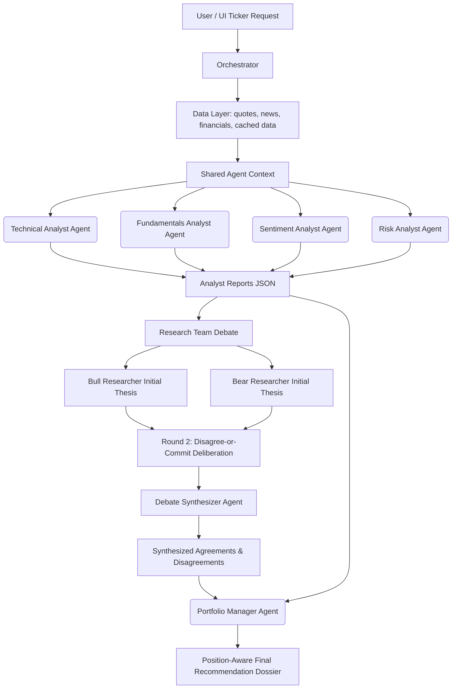

# PSX Investment Advisor — AI-Powered Financial Intelligence

A premium, multi-agent financial advisory platform for the **Pakistan Stock Exchange (PSX)**. The system models a professional wealth management committee, orchestrating specialized AI analyst agents to analyze technicals, fundamentals, sentiment, and risk, conduct a dialectical debate, and formulate a position-aware final recommendation dossier.

> **Note**: This is a personal side-project at `E:\Investment Advisor` — separate from NCL/Finqalab corporate work. It is designed for educational/research purposes under a "not financial advice" model.

---

## 🏛️ Architecture Overview

The platform uses a pipeline of orchestrated **Gemini** agents, integrating deterministic calculations with advanced LLM reasoning to ensure zero arithmetic hallucinations and counter agent sycophancy.



### Key Architectural Patterns
1. **Arithmetic Separation (FinAgent)**: Numeric indicator calculations (RSI, MACD, Bollinger Bands, Drawdown, Beta) are performed in Python using `ta`, `pandas`, and `numpy`. The AI agents interpret the pre-computed results instead of calculating them, avoiding arithmetic hallucinations.
2. **Disagree-or-Commit Deliberation (FinCom)**: A structured debate between Bull and Bear researchers to challenge assumptions, surface contrarian risks, and prevent conformity bias.
3. **Grounded Debate Synthesis**: A dedicated synthesizer agent acts as a debate arbitrator, extracting genuine agreements and disagreements based purely on the debate transcript (excluding fabrication), while programmatic checks calculate conviction gaps.
4. **Position-Aware Sizing (FinPos)**: The Portfolio Manager agent adjusts advice based on current holdings and flags overconcentration (>15% portfolio weight).
5. **Layered Memory (FinMem)**: SQLite-backed TTL caching (market quotes: 5min, news: 1hr, fundamentals: 24hr) to respect rate limits and reduce latency.

---

## 📂 Codebase Directory Map

The project consists of ~45 source files grouped by functional layers:

```
├── agents/                      # Multi-Agent pool & personas
│   ├── base_agent.py            # Gemini SDK wrapper, retry logic, thinking budget
│   ├── technical_analyst.py     # Technical analysis reasoning
│   ├── fundamentals_analyst.py  # Fundamental/Valuation reasoning & directional trends
│   ├── sentiment_analyst.py     # News classification & narrative tracking
│   ├── risk_analyst.py          # Portfolio risk limits & volatility assessment
│   ├── research_team.py         # Conducts Bull vs Bear debate & grounded synthesis
│   ├── portfolio_manager.py     # Portfolio Manager synthesis & final verdict
│   ├── orchestrator.py          # Pipelines execution & manages caching
│   └── prompts.py               # Persona definitions & system instructions
│
├── data/                        # Financial data ingestion & caching
│   ├── market_data.py           # yfinance & PSX data fetching
│   ├── technical_indicators.py  # Mathematical computation of indicators
│   ├── news_data.py             # RSS feed & news fetcher
│   ├── live_scraper.py          # AskAnalyst scraping & live data refresh
│   ├── local_data.py            # Financial data extracts and files
│   ├── cache.py                 # SQLite TTL Cache logic
│   ├── advisor_cache.db         # Cache database
│   ├── portfolio.db             # Holdings database
│   └── psx_tickers.py           # Curated universe (~70 KSE-100 names)
│
├── portfolio/                   # Position sizing and management
│   └── manager.py               # Handles user holdings & concentration flags
│
├── report/                      # Dossier PDF generation
│   └── pdf_generator.py         # ReportLab PDF compilation
│
├── static/                      # Web UI Frontend (Vanilla CSS, JS, HTML)
│   ├── index.html               # Main user dashboard
│   ├── css/style.css            # Styling & layout
│   └── js/app.js                # Frontend controller & UI interactions
│
├── scratch/                     # Temporary testing files & scratch scripts
│
├── app.py                       # Main Flask web app containing API routes
├── main.py                      # Firebase Cloud Functions entrypoint wrapper
├── config.py                    # Environment settings configuration
├── requirements.txt             # Python dependency requirements
├── firebase.json                # Firebase hosting and functions deploy config
└── README.md                    # This documentation file
```

---

## 🚀 Getting Started

### 1. Prerequisites
- Python 3.8+
- A Google Gemini API Key (get one at [Google AI Studio](https://aistudio.google.com/))

### 2. Installation
Clone the repository and install the dependencies:
```bash
pip install -r requirements.txt
```

### 3. Environment Setup
Create a `.env` file in the root directory and add your credentials:
```ini
GEMINI_API_KEY=your_actual_gemini_api_key_here
FLASK_DEBUG=true
```

### 4. Running the Application Locally
Start the Flask development server:
```bash
python app.py
```
Open your browser and navigate to `http://localhost:5000`.

---

## 🌐 Deploying to Firebase

The application is configured to deploy to Firebase Hosting & Cloud Functions (using `main.py` to wrap the Flask app).

1. Ensure the Firebase CLI is installed and you are logged in:
   ```bash
   npm install -g firebase-tools
   firebase login
   ```
2. Initialize and select your project:
   ```bash
   firebase use --add
   ```
3. Deploy the application:
   ```bash
   firebase deploy
   ```

---

## 📊 Curated Ticker Universe

The system focuses on **~70 major KSE-100 companies** spanning all key sectors:
- **Oil & Gas**: OGDC, PPL, PSO, MARI, POL, ATRL, SNGP
- **Banking**: HBL, UBL, MCB, NBP, MEBL, BAFL, BAHL, ABL
- **Cement**: LUCK, DGKC, MLCF, FCCL, KOHC, PIOC, CHCC
- **Fertilizer**: ENGRO, EFERT, FFC, FATIMA, FFBL
- **Power**: HUBC, KEL, KAPCO
- **Technology**: SYS, TRG, AVN, NTS
- **Textile, Pharma, Food, Automobile, Steel, Chemical, Insurance, Packaging**

---

## ⚖️ SECP Regulatory Context & Disclaimer

> [!IMPORTANT]
> Under the **SECP Research Analysts Regulations (2015)**, providing buy/sell/hold stock recommendations to the public requires formal registration as a licensed Research Analyst. This platform operates purely as an **educational/personal simulator** with faked portfolio holdings and is **not intended for commercial use or distribution to the public**.

*This software is created for educational and research purposes only. It is **not financial advice**. The application does not connect to brokerage protocols or execute live transactions. All trading carries risk. Always consult a licensed fiduciary advisor before investing.*
