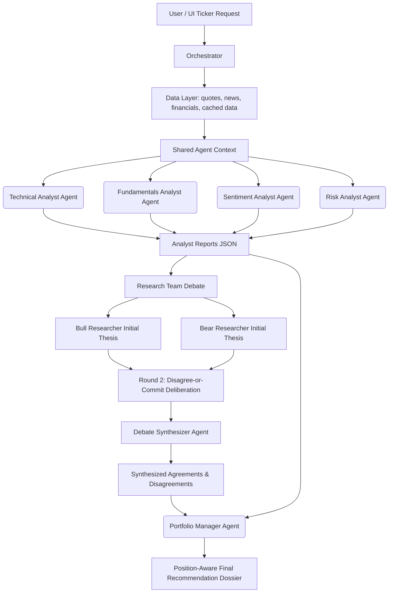

# PSX Investment Advisor — AI-Powered Financial Intelligence

A premium, multi-agent financial advisory platform for the **Pakistan Stock Exchange (PSX)**. The system models a professional wealth management committee, orchestrating specialized AI analyst agents to analyze technicals, fundamentals, sentiment, and risk, conduct a dialectical debate, and formulate a position-aware final recommendation dossier.

> **Note**: This is a personal side-project at `E:\Investment Advisor` — separate from NCL/Finqalab corporate work. It is designed for educational/research purposes under a "not financial advice" model.

---

## 🏛️ Architecture Overview

The platform uses a **LangGraph**-orchestrated pipeline of specialist agents (Technical, Fundamental, Sentiment, Risk run in parallel, then a debate and synthesis stage), integrating deterministic calculations with advanced LLM reasoning to ensure zero arithmetic hallucinations and counter agent sycophancy.

**Model backend.** Agents run on a **Gemini-only**, two-tier layer served through **Google Vertex AI** (Vertex project `VERTEX_PROJECT`; Firebase/Firestore is the separate `aiforpsx` project): a *reasoning* tier (`gemini-3.1-pro`) and a *fast* tier (`gemini-3.5-flash`), routed per agent role (`MODEL_TIERS` / `ROLE_TIER` in `config.py`). DeepSeek is intentionally excluded from all routing — the Google Cloud $300 free-trial credit does not cover Vertex partner MaaS models (DeepSeek/Claude/Llama/Mistral); `DEEPSEEK_API_KEY` is read from env only, for a future paid-account re-enable. Authentication is via Application Default Credentials — no per-provider model API keys at runtime.



### Key Architectural Patterns
1. **Arithmetic Separation (FinAgent)**: Numeric indicator calculations (RSI, MACD, Bollinger Bands, Drawdown, Beta) are performed in Python using `ta`, `pandas`, and `numpy`. The AI agents interpret the pre-computed results instead of calculating them, avoiding arithmetic hallucinations.
2. **Disagree-or-Commit Deliberation (FinCom)**: A structured debate between Bull and Bear researchers to challenge assumptions, surface contrarian risks, and prevent conformity bias.
3. **Grounded Debate Synthesis**: A dedicated synthesizer agent acts as a debate arbitrator, extracting genuine agreements and disagreements based purely on the debate transcript (excluding fabrication), while programmatic checks calculate conviction gaps.
4. **Position-Aware Sizing (FinPos)**: The Portfolio Manager agent adjusts advice based on current holdings and flags overconcentration (>15% portfolio weight).
5. **Layered Memory (FinMem)**: SQLite-backed TTL caching (quotes: 10s, history: 15min, news: 1hr, fundamentals: 24hr) to respect rate limits and reduce latency, backed by a **Firestore** store of company financials and price history.
6. **Automated DCF Engine**: A 2-stage FCFE discounted cash-flow model (`data/dcf_engine.py`) computes Base/Bull/Bear intrinsic values and a sensitivity matrix from *live, company-specific* inputs — risk-free rate from **SBP EasyData** (T-bill / policy rate), beta computed vs. the KSE-100, and a historical growth CAGR derived from filed statements. Results are fed to the Fundamentals Analyst as grounded evidence.
7. **API-First Data, Firecrawl for Prose**: Structured numeric data (financial statements, OHLCV prices, ratios) is pulled from the **AskAnalyst / PSX DPS JSON APIs** — never HTML-scraped. **Firecrawl** is used only for *unstructured* content (news article full-text, research reports) where there is no clean API.
8. **Hourly Stock Data & 7-Day Retention (FinHourly)**: Fetches raw intraday transaction ticks directly from the official PSX Data Portal, aggregates them into hourly OHLCV bars, and stores/merges them in Firestore. A strict 7-day TTL retention policy is programmatically enforced to control Firestore database storage costs.

---

## 📂 Codebase Directory Map

The project consists of ~45 source files grouped by functional layers:

```
├── agents/                      # Multi-Agent pool & personas
│   ├── base_agent.py            # Gemini SDK wrapper, retry logic, thinking budget
│   ├── technical_analyst.py     # Technical analysis reasoning
│   ├── fundamentals_analyst.py  # Fundamental/Valuation reasoning & directional trends
│   ├── sentiment_analyst.py     # News classification & narrative tracking
│   ├── risk_analyst.py          # Portfolio risk limits & volatility assessment
│   ├── research_team.py         # Conducts Bull vs Bear debate & grounded synthesis
│   ├── portfolio_manager.py     # Portfolio Manager synthesis & final verdict
│   ├── orchestrator.py          # Pipelines execution & manages caching
│   └── prompts.py               # Persona definitions & system instructions
│
├── data/                        # Financial data ingestion & caching
│   ├── market_data.py           # Quotes, OHLCV history, fundamentals, statements
│   │                            #   (AskAnalyst / PSX DPS JSON APIs; Firestore-first)
│   ├── dcf_engine.py            # 2-stage FCFE discounted cash-flow valuation engine
│   ├── sbp_easydata.py          # State Bank of Pakistan macro data (rates, M2, FX, risk-free)
│   ├── institutional_flows.py   # MUFAP / LIPI-FIPI institutional flow context
│   ├── retail_sentiment.py      # Broker research & retail sentiment signals
│   ├── firecrawl_client.py      # Firecrawl REST wrapper (unstructured content only)
│   ├── technical_indicators.py  # Mathematical computation of indicators & risk suite
│   ├── news_data.py             # RSS feed & news fetcher
│   ├── live_scraper.py          # Per-run live news refresh (AskAnalyst API)
│   ├── local_data.py            # Research reports, news, financials text assembly
│   ├── cache.py                 # SQLite TTL Cache logic
│   ├── advisor_cache.db         # Cache database
│   ├── portfolio.db             # Holdings database
│   └── psx_tickers.py           # Curated universe (~70 KSE-100 names)
│
├── portfolio/                   # Position sizing and management
│   └── manager.py               # Handles user holdings & concentration flags
│
├── report/                      # Dossier PDF generation
│   └── pdf_generator.py         # ReportLab PDF compilation
│
├── static/                      # Web UI Frontend (Vanilla CSS, JS, HTML)
│   ├── index.html               # Main user dashboard
│   ├── css/style.css            # Styling & layout
│   └── js/app.js                # Frontend controller & UI interactions
│
├── scratch/                     # Temporary testing files & scratch scripts
│
├── app.py                       # Main Flask web app containing API routes
├── main.py                      # Firebase Cloud Functions entrypoint wrapper
├── config.py                    # Environment settings, model + Firebase init
│
│   # ── Data ingestion / maintenance scripts ──
├── backfill_firestore.py        # Bulk-load all PSX companies (statements + 1y OHLCV) to Firestore (rate-paced)
├── archive_hourly_data.py       # Fetch, aggregate, and store hourly data (7-day retention)
├── refresh_market_data.py       # Master script to refresh market data, RSS news, and archive hourly data
├── scrape_askanalyst.py         # AskAnalyst statement-fetch helpers (income/balance/cash-flow)
├── refresh_company_data.py      # Per-ticker company data refresh
├── download_research_reports.py # Download + extract broker research PDFs to markdown
├── fetch_news_content.py        # Enrich news with full article text (Firecrawl-backed)
├── fetch_market_intelligence.py # Market-wide news/RSS aggregation
├── fetch_macro_data.py          # SBP macro snapshot refresh
│
├── requirements.txt             # Python dependency requirements
├── firebase.json                # Firebase hosting and functions deploy config
└── README.md                    # This documentation file
```

---

## 🚀 Getting Started

### 1. Prerequisites
- Python 3.8+
- **Google Cloud SDK** (`gcloud`) — the app authenticates to Vertex AI and Firestore via Application Default Credentials
- Access to the `aiforpsx` Google Cloud / Firebase project

### 2. Installation
Clone the repository and install the dependencies:
```bash
pip install -r requirements.txt
```

### 3. Authenticate (Application Default Credentials)
The model layer (Vertex AI) and Firestore both use ADC. Sign in once:
```bash
gcloud auth application-default login
```
> The app pins the Firebase/Firestore project to `aiforpsx` (`FIREBASE_PROJECT_ID` in `config.py`). This override is required because `gcloud`'s *default* project may differ from `aiforpsx` — without it the SDK targets the wrong project and Firestore returns "database does not exist".

### 4. Environment Setup
Create a `.env` file in the root directory:
```ini
# Model layer (Vertex AI Agent Platform) — uses ADC, no model API keys needed
USE_VERTEX=true
VERTEX_PROJECT=project-744d0520-c16e-4aa5-b3e
VERTEX_LOCATION=us-central1

# Firestore / Firebase (override only if not aiforpsx)
# FIREBASE_PROJECT_ID=aiforpsx

# Firecrawl — required only for news/research full-text extraction
FIRECRAWL_API_KEY=fc-your_key_here

# Optional: SBP EasyData API key for macro data (falls back to public scrape)
# SBP_EASYDATA_API_KEY=...

FLASK_DEBUG=true
```

### 5. Backfill Firestore (first run)
Populate company financials and 12-month price history for all PSX companies. The scripts enforce a global 1.0s rate-limit pacing lock to respect the AskAnalyst API rate limit (60 requests/minute):
```bash
# Validate fetch + shape without writing
python backfill_firestore.py --dry-run --tickers ABOT OGDC

# Small live batch, then the full universe (with concurrency and sleep pacing)
python backfill_firestore.py --tickers ABOT OGDC LUCK
python backfill_firestore.py --all --skip-existing --workers 2 --sleep 5.0
```

### 6. Running the Application Locally
Start the Flask development server:
```bash
python app.py
```
Open your browser and navigate to `http://localhost:5000`.

---

## 🌐 Deploying to Firebase

The application is configured to deploy to Firebase Hosting & Cloud Functions (using `main.py` to wrap the Flask app).

1. Ensure the Firebase CLI is installed and you are logged in:
   ```bash
   npm install -g firebase-tools
   firebase login
   ```
2. Initialize and select your project:
   ```bash
   firebase use --add
   ```
3. Deploy the application:
   ```bash
   firebase deploy
   ```

---

## 📊 Curated Ticker Universe

The system focuses on **~70 major KSE-100 companies** spanning all key sectors:
- **Oil & Gas**: OGDC, PPL, PSO, MARI, POL, ATRL, SNGP
- **Banking**: HBL, UBL, MCB, NBP, MEBL, BAFL, BAHL, ABL
- **Cement**: LUCK, DGKC, MLCF, FCCL, KOHC, PIOC, CHCC
- **Fertilizer**: ENGRO, EFERT, FFC, FATIMA, FFBL
- **Power**: HUBC, KEL, KAPCO
- **Technology**: SYS, TRG, AVN, NTS
- **Textile, Pharma, Food, Automobile, Steel, Chemical, Insurance, Packaging**

---

## ⚖️ SECP Regulatory Context & Disclaimer

> [!IMPORTANT]
> Under the **SECP Research Analysts Regulations (2015)**, providing buy/sell/hold stock recommendations to the public requires formal registration as a licensed Research Analyst. This platform operates purely as an **educational/personal simulator** with faked portfolio holdings and is **not intended for commercial use or distribution to the public**.

*This software is created for educational and research purposes only. It is **not financial advice**. The application does not connect to brokerage protocols or execute live transactions. All trading carries risk. Always consult a licensed fiduciary advisor before investing.*
